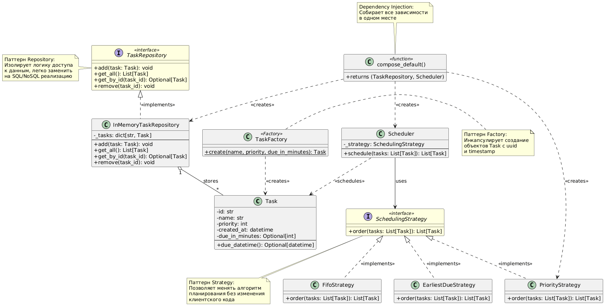

# Task Scheduler — Демонстрация паттернов и Clean Code

Учебный проект для демонстрации шаблонов проектирования и принципов чистого кода.

## Описание

Task Scheduler — система планирования задач с разными стратегиями упорядочивания:
- По времени создания (FIFO)
- По приоритету
- По ближайшему дедлайну

## Реализованные паттерны

1. **Factory** — `TaskFactory.create()` для создания задач с uuid и timestamp
2. **Strategy** — 3 алгоритма планирования (FIFO, Priority, EarliestDue)
3. **Repository** — абстракция хранилища данных (легко заменить на БД)
4. **Dependency Injection** — сборка зависимостей в `compose_default()`

## Принципы Clean Code

- ✅ Неизменяемые объекты (`@dataclass(frozen=True)`)
- ✅ Одна ответственность у каждого класса (SRP)
- ✅ Интерфейсы вместо конкретных реализаций (DIP)
- ✅ Читаемые имена (`schedule()`, `due_datetime()`)
- ✅ Типизация и docstrings
- ✅ Короткие функции и методы

## Структура проекта

```
asik7spd/
├── main.py              # Весь исходный код (~190 строк)
├── diagram.png          # UML-диаграмма классов
└── README.md            # Этот файл
```

## Как запустить

```powershell
cd C:\Users\user\Documents\asik7spd
python main.py
```

**Вывод:**
```
Order (by priority):
- High priority task (priority=10)
- Medium priority task (priority=5)
- Low priority task (priority=0)
```

## UML-диаграмма



Диаграмма показывает все классы, интерфейсы и связи между компонентами системы с пояснениями паттернов.
